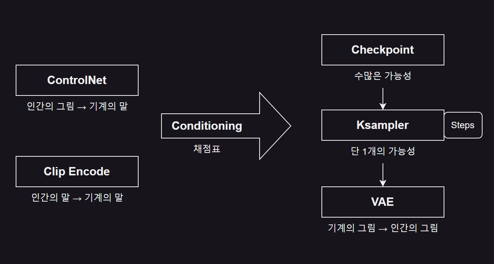
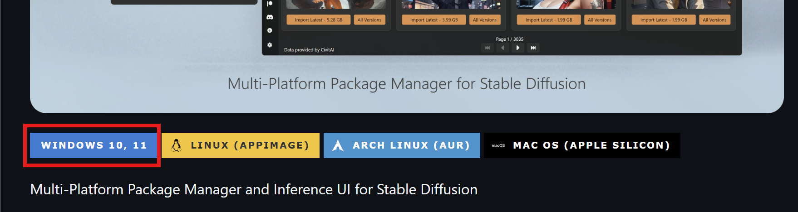
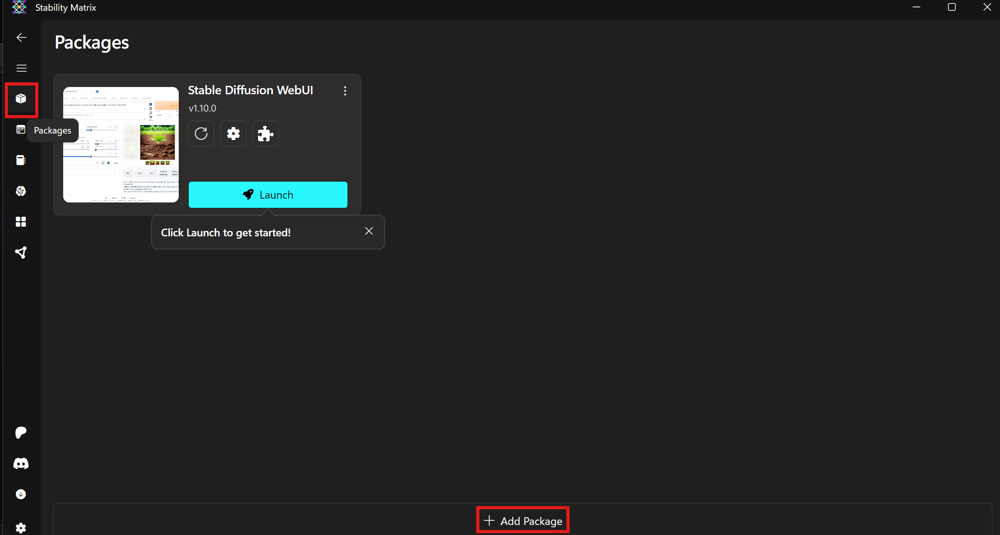
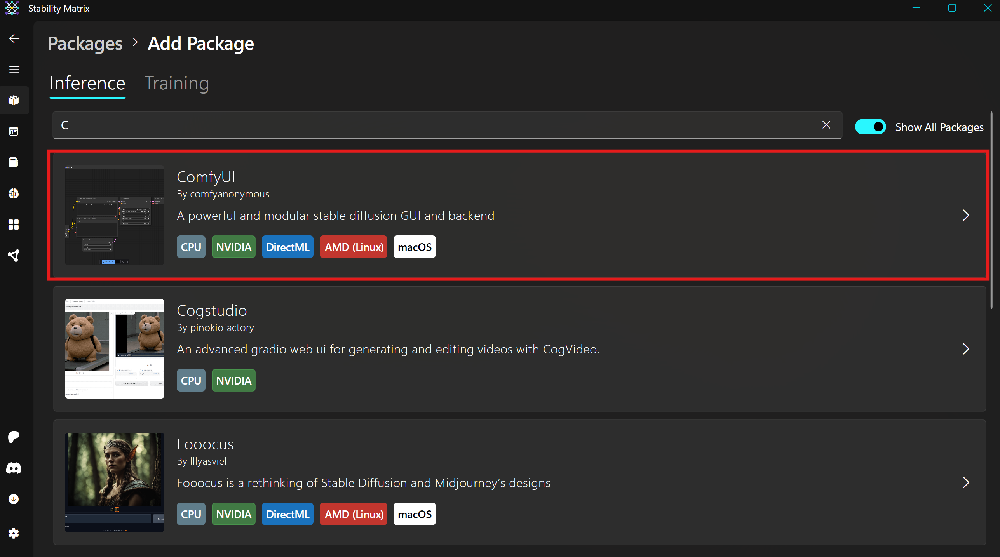
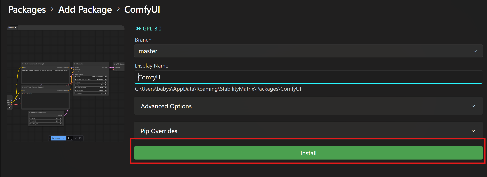
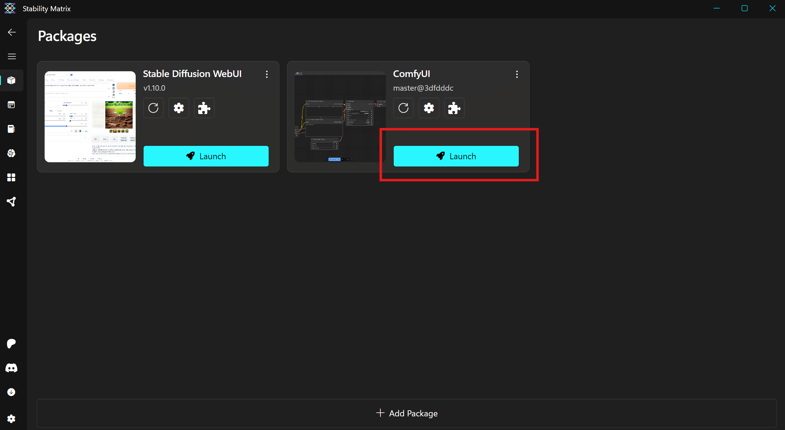
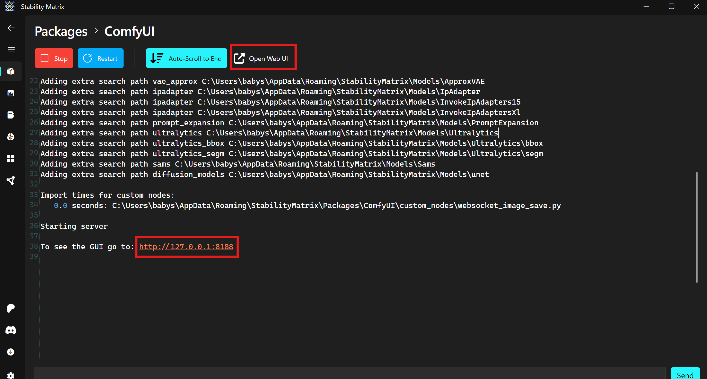
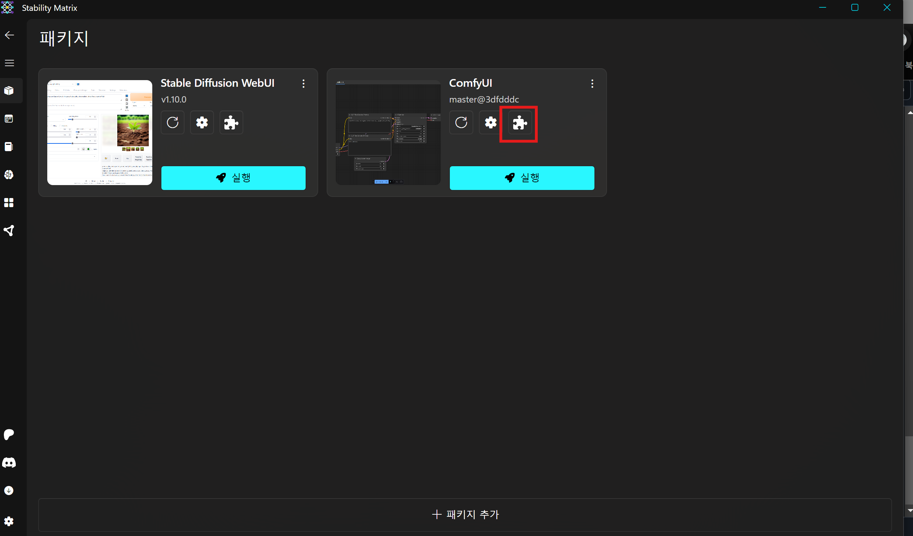
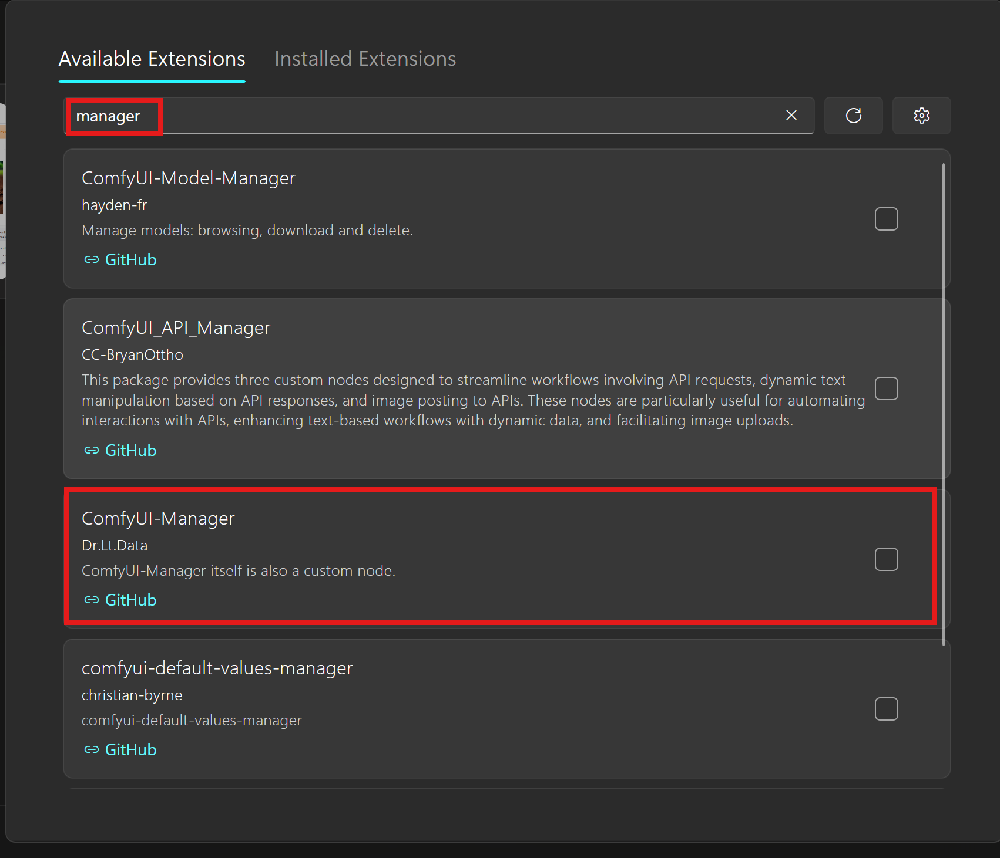
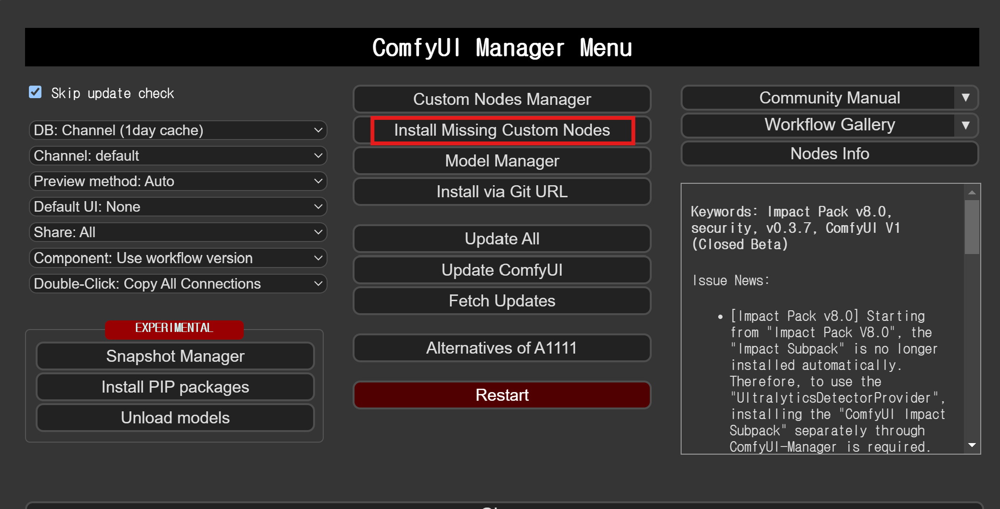

# ComfyUI

Stable Diffusion
---
- Stability AI 에서 배포한 이미지 생성 AI 툴

- 오픈 소스로 누구나 사용할 수 있도록 공개

- 디지털 도화지 위의 수많은 가능성 속에서 우리가 이야기하는 말이나 그림 등을 토대로 가능성을 좁혀나가는 과정

- 장정

  - 무료
 
  - 자신의 컴퓨터에 설치하여 사용 가능
 
  - ControlNet, Lamma, IP-Adapter 등 다양한 AI 와 결합해서 다양한 기능 지원
 
  - 포토샵, 크리타, 블렌더 등 외부 프로그램과의 연동 자유로움
 
  - 빠른 발전 속도
 
    - 새로운 AI 기능이 등장하면, 1주일 내에 결합해서 사용 가능
   
  - 사용자가 자신의 취향에 따라 디테일하게 조정 가능
 
- 단점

  - 편리하게 접속해서 사용할 수 있는 미드저니(Midjourney) 등과 달리 사용자가 직접 컴퓨터에 설치해야 함
 
  - Git 이나 Python 등 툴 필요
 
    - 예전보다 쉽게 설치할 수 있는 StabilityMatrix 등 프론트엔드 툴이 등장해 사용이 편해지는 중
   
  - 생성형 AI 는 GPU 를 사용하므로, 성능이 좋은 Nvidia 기반의 그래픽카드 필수
 
<br>

|도식화|
|-|
||
|- **Checkpoint** : 수많은 이미지의 가능성을 담고 있는 마법상자, 체크포인트에 따라 그릴 수 있는 가능성 종류가 다름<br>&nbsp;&nbsp;&nbsp;&nbsp;&nbsp;&nbsp;&nbsp;&nbsp;&nbsp;&nbsp;&nbsp;&nbsp;&nbsp;&nbsp;&nbsp;&nbsp;&nbsp;&nbsp;&nbsp;&nbsp;&nbsp;&nbsp;&nbsp;&nbsp;어떤 체포인트는 실사 가능성이 높고, 어떤 건 애니메이션이 될 가능성이 높음<br><br>- **Clip Encode & ControlNet** : 글과 그림을 기계의 말로 바꿈<br><br>- **Conditioning** : 가능성을 걸러내는 역할(채점표)<br><br>- **KSampler** : 체크포인트에 있는 수많은 가능성을 걸러내는 체 역할, Conditioning 기준으로 걸러냄<br>&nbsp;&nbsp;&nbsp;&nbsp;&nbsp;&nbsp;&nbsp;&nbsp;&nbsp;&nbsp;&nbsp;&nbsp;&nbsp;&nbsp;&nbsp;&nbsp;&nbsp;&nbsp;&nbsp;&nbsp;&nbsp;&nbsp;Step : 몇 번 걸러낼지 결정하는 것<br><br>- **VAE** : 걸러진 1개의 가능성을 사람이 볼 수 있는 이미지로 변환하는 역할|

<br>

---

<br>

ComfyUI(컴피유아이)
---
- 프로그래밍 능력이 좋아야하는 Stable Diffusion 을 쉽게 사용할 수 있게 도와주는 도구

- 노드들을 연결해 기능 구현

- 매우 복잡

- 다양한 작업 수행 가능

  - **완전한 유연성** : 각 작업을 노드로 시각화하여, 자신만의 맞춤형 워크플로우 설계 가능
 
  - **빠른 업데이트** : 최신 AI 기술이 나오면 며칠 안에 커스텀 노드를 통해 바로 사용 가능
 
  - **고급 사용자에게 최적** : 창의적인 작업을 최대한 자유롭게 구현하고자 하는 사용자에게 이상적

<br>

### ComfyUI vs WebUI
|ComfyUI|WebUI|
|-|-|
|- 익숙해지기는 어렵지만, 한번 익숙해지면 자유로운 작업 가능<br>- 요리로 치면 밀가루부터 반죽하는 느낌<br>- 발전 속도가 빨라 새로운 AI 가 등장하면 2~3일 내에<br>&nbsp;&nbsp;&nbsp;ComfyUI 에 커스텀 노드로 결합되어 사용 가능|- 사용하기 쉬움<br>- 깊이 들어가면 한계 존재<br>- 요리로 치면 컵라면 or 밀키트 느낌|

<br>

---

<br>

StabilityMatrix
---
### StabilityMatrix 설치
- [사이트 이동](https://github.com/LykosAI/StabilityMatrix) 후 하단에서 OS 별 다운로드 진행

- 적절한 곳에 압출 푼 후  StabilityMatrix.exe 파일 실행

- Stable Diffusion WebUI 설치

  - 설치하면서 학습 모델(Checkpoint Model) 등도 함께 설치할 수 있어 편리(Civita API 필요)
 
  - StabilityMatrix 로 설치된 WebUI, ComfyUI 등의 모델들은 설치된 모델을 공유하므로 관리하기 쉬움

|-|
|-|
||

<br>

### ComfyUI 설치
- StabilityMatrix 실행 수 왼쪽 **패키지 아이콘** 클릭

- Add Package 버튼 누른 후 ComfyUI 설치

  - 옵션은 딱시 설정할 것 없으므로 바로 Install 버튼 눌러 설치
 
- Launch 버튼 클릭으로 간단히 실행 가능

  - 아무것도 뜨지 않는다면 **Open Web UI** 버튼 누르면 웹페이지가 열림

|-|
|-|
||
||
||
||
||

<br>

### 파일 위치
- ComfyUI 설치 경로

> 기본 위치에 설치했다면
```
  C:\<사용자>\AppData\Roaming\StabilityMatrix\Packages\ComfyUI
```

- 모델 파일 경로

|타입|폴더 위치|
|-|-|
|ComfyUI 단독 설치형의 모델 위치|ComfyUI\models\|
|StabilityMatrix 의 ComfyUI 설치 위치|\Packages\ComfyUI\|
|StabilityMatrix 의 모델 위치|\Models|

- 커스텀 노드 중 일부분은 공용 폴더 위치를 무시하고, ComfyUI\models 폴더에 없으면 오류 발생

  - ComfyUI\models 폴더에 옮겨야험

<br>

---

<br>

ComfyUI Manager
---
- ComfyUI 사용시 편리한 기능을 제공하는 확장 기능(extension)

  - ComfyUI 내에서 필요한 커스텀 노드 설치하기
 
  - 워크플로우에 없는 노드 업데이트
 
  - 재시작
 
  - Workflow 갤러리 보기
 
- [공식 페이지](https://github.com/itdrdata/ComfyUI-Manager)

- 다른 노드를 설치할 때 필수인 편리한 커스텀노드이지만 설치가 어려움

  - StabilityMatrix 이용시 원클릭으로 설치 가능
 
- 다른 사람이 만든 노드를 사용할 때, 빠진 커스텀 노드들을 한 번에 다운로드 받아 사용 가능
 
<br>

### 설치
|-|
|-|
||
||

<br>

### 빠진 커스텀 노드 설치
|-|
|-|
||

💡 주의
```
  ComjyUI Manager 사용하면 빠진 노드를 쉽게 설치할 수 있지만, 커스텀 노드에 따라 필요한 모델 파일등은 별개로 설치해야 하는 경우도 많음
  
  특히 IP-Adapter 계열이 따로 설치해야 하는 경우가 많음
  
  이 경우는 각각의 인스톨 환경을 살펴보아야 하며, 인스톨 환경은 커스텀 노드 리스트에서 커스텀 노드 이름을 클릭하면 됨
```

<br>
